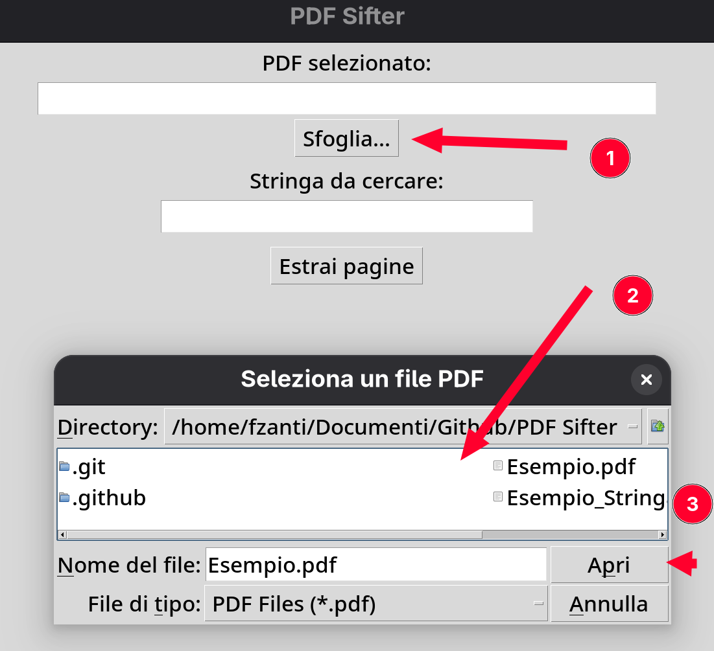

### PDF Sifter

PDF Sifter serve per stampare in maniera agevole i PDF, filtrando le pagine per parole chiave

### Download

- Windows: è possibile scaricare il file eseguibile direttamente da [qui](https://github.com/FrancescoZanti/PDF-Sifter/releases)

### Utilizzo

1. Aprire il programma
2. Selezionare il file da controllare

3. Indicare la parola chiave / la stringa da cercare

4. Cliccare sul pulsante "Estrai pagine" per estrarre le pagine che contengono la parola chiave

5. Infine visionare il file pdf risultante 

### Contribuire

Se vuoi contribuire al progetto apri una issue o una pull request.